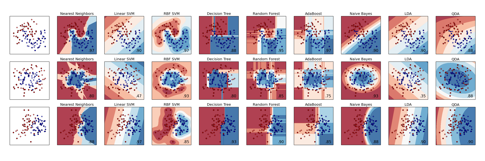

##--------------------------------------------------------------------------------------------
  
## 1.   Synopsis

In this project we build a machine learning model to predict the quality of an activity -- specifically, performing Dumbbell Biceps Curls.  Six participants were asked to perform Dumbbell Curls in five different fashions labelled A to E, with class A being the correct execution of this exercise, while classes B to E represent common mistakes.  Accelerometer and magnetometer data were collected from sensors on the belt, arm, forearm and dumbell of the participants.  

These data comprising 19,662 observations on 160 variables, appropriately labelled with their class, were made available in a CSV file and were used to train the model.  A separate set of 20 observations, without class labels, is provided in order to test the model.  Two attempts are given to get all 20 predictions right. 

The model for solving this multi-class Classification problem is developed using machine learning best practices and a Support Vector Machine (SVM) classifier from the e1071 library in R.  The package e1071 is an interface to the award-winning C++ implementation ***libsvm***.[1]  Our model achieves an accuracy of over 99% in validation on a subset of the training data and has a 100% success rate when used to identify classes in the test data.  

##--------------------------------------------------------------------------------------------

## 2.   Data Processing
  
Before reading in the data we set global knitr chunk options and load all required libraries.

```{r 1-knitr}
library(knitr); opts_chunk$set(cache = TRUE, message = FALSE, warning = FALSE, comment = NA)
```
```{r 2-libs}
library(caret);     library(e1071);     library(Rtsne);      
library(dplyr);     library(tidyr);     library(ggplot2)
```
The training and test data files are placed in the working directory.  A preliminary glance at
the training data indicates a large number of columns entirely empty or filled with NAs or the characters "#DIV/0!".  The file is read in so as to place NAs in all these columns.

```{r 3-read-File}
pmlData <- read.csv("pml-training.csv", na.strings = c("NA", "", "#DIV/0!"), strip.white = TRUE)
```

### 2.1    Data Cleaning

The columns with NAs are idenitied and removed fron the data set.  

```{r 4-find-NAs}
pmlNAcols <- unlist(lapply(pmlData, function(x) any(is.na(x))))
sum(pmlNAcols)

pmlData <- pmlData[, !pmlNAcols]
glimpse(pmlData[, 1:10])
```

Columns 1 to 7 contains the participants' names, timestamps and window identifiers.  They are not relevant to the development of the model and are also removed.

```{r 5-Rem-Cols-1-7}
subData <- pmlData[, -c(1:7)]
# rm(pmlData)                   # do later after testing
dim(subData)
glimpse(subData[, 45:53])
```
We are left with `r dim(subData)[2]` columns, of which 52 are predictors (aka features) and one is the outcome -- column # 53, $classe.  The features are all numeric or integers, while $classe is a factor.

### 2.2    Data Exploration

It would be convenient to reduce the number of features, but such summarization must be balanced against information loss.  Since the number of observations is large relative to the number of features, we err on the side of retaining features unless we have strong reason to believe that they add no value to the model building.  This matter will be re-visited if initial attempts to build an accurate and speedy model are inadequate.  

####    Near-Zero Variance

We check for features with zero or near-zero variance, but there are none.

```{r 6-NZV}
nearZeroVar(subData)
```
  
####    Correlated Features

We check for features with a pair-wise absolute correlation >= 0.90 and remove them from the data set.

```{r 7-Find-Correlation}
corM <- cor(subData[,1:52])
FC90 <- findCorrelation(corM)
length(FC90)
subData <- subData[, -FC90]

nF <- dim(subData)[2] - 1       # nF = number of remaining features.
dim(subData)
```
[Experiments with the e1071 SVM classifier using the RBF kernel (Radial Basis Function) show that such feature reduction gives a marginal improvement in accuracy, but reduces training time by 30%.] 

We now have `r nF` features left.  It would help our intuition regarding classifier selection if they could be visualized together.  
  
  
####    2-D Visualization of Feature Set
  
  
**t-distributed Stochastic Neighbor Embedding** (t-SNE) is a non-linear dimensionality reduction technique that is well suited for visualizing high-dimensional data in two or three dimensions [2, 3].  It maps high-dimensional vectors to a 2-D or 3-D point so that similar objects are represented by nearby points and dissimilar objects by distant points.

The t-SNE co-ordinates are calculated and plotted using a random 50% subset of the data, as this is a time-consuming  process.

```{r 8-tSNE-Map, fig.height = 6, fig.width = 8}
set.seed(10)
tSNEinx  <- createDataPartition(y = subData$classe, p = 0.50, list =  FALSE)
tSNE     <- subData[tSNEinx,]

system.time(tSNE_2D <- Rtsne(as.matrix(tSNE[,1:nF]), check_duplicates = FALSE, 
                                perplexity = 20, theta = 0.25, initial_dims = 40))

qplot(tSNE_2D$Y[,1], tSNE_2D$Y[,2], col = tSNE$classe)
```
  
####         **Fig 1: t-distributed Stochastic Neighbor Embedding Plot of 45 Features** 
  
  
### 2.3    Data Partitioning

The data is partitioned into two sets -- 70% for training the model and 30% for validation.

```{r 9-Data-Partition}
set.seed(10)
tInx  <- createDataPartition(y = subData$classe, p = 0.7, list =  FALSE)
train <- subData[ tInx, ]
valid <- subData[-tInx, ]
# rm(subData)               # later after testing.  Does this free-up any memory?
```
  
##--------------------------------------------------------------------------------------------

##  3.  Classifier Selection

As a general rule, there are three criteria for measuring Machine Learning algorithms: Accuracy, Performance and Interpretability.

1. Accuracy: We are given two attempts at making 20 predictions.  A rough calculation says that getting 19 out of 20 predictions correct requires an accuracy of 95%.  To have an 80% probability of getting all 20 correct, we need an accuracy of 0.80 ^ (1/20) = `r round((0.80^(1/20)) * 100, 1)`%.  We set these accuracies as goals for the model in the 1st and 2nd prediction attempts on the test data.

2. Performance: The model is being developed on a Windows 8.1 PC, with Intel i3-4130 CPU, 8 GB RAM, 256 GB SSDs, etc. - by no means a top-end machine.  A classifier-model that does the job in a couple of minutes or so should be considered a good performer.

3. Interpretabilty: In this scenario, the predicted class labels, A to E, have their own well-defined interpretation.  e.g. C = lifting the dumbell only halfway.  Further interpretation based on `r nF` parameters, such as magnet-belt-y, do not add value to exercise-concious people.

SVMs are known to be un-interpretable.  That should not be a consideration in this project; their accuracy and performance proves to be more than adequate.  

  
  
####         **Fig 2: Classifier Comparison** (source: [scikit learn](http://scikit-learn.org/stable/auto_examples/classification/plot_classifier_comparison.html))[4]
  

Fig 2 shows the decision boundaries used by various classifier and their accuracy for different distributions of data.  A comparison with Fig 2, the t-SNE plot, shows similarities between the decision boundaries of an RBF SVM classifier and that required by our data set.  Further, the accuracy of RBF SVM classifiers are at the top, except for very linear class boundaries.

Fig 2 depicts two-dimensional, binary classification, but SVMs scale well with higher dimensions (and volume of data) and can handle multiple classes as well.  We opt for the e1071 RBF SVM classifier as a starting point.

##--------------------------------------------------------------------------------------------

##  4.  Model Development

Model development is performed in four stages -- Training, Cross-Validation & Error Estimation, Validation and Testing.  Tuning is conducted after a model achieves around 95% accuracy in Validation tests.

### 4.1     Model Training

The model is trained using the default values for parameters.  The e1071 RBF SVM does scaling automatically and has an option for k-fold CV.  However, the results of the CV, such as those required to estimate out-of-sample error, are not accessible.  Further, from experience, accuracy is not significantly improved by CV (on this data set), while it takes longer to run.  Yet, trials have shown that e1071 is preferable to the caret-kernlab SVM interface for reasons of performance and accuracy.

```{r 10-Train}
(t1 <- system.time(SVM_M1 <- svm(classe ~ ., data = train)))
```

Only `r t1[1]` seconds for training at the first pass.  Not bad!

### 4.2     Error Estimation - Cross Validation

We make 5-folds (programmatically) from the training data set and perform CV using one as a holdout.

#
```{r 11-Cross-Validation}
x <- 1
##  Not enough time to investigate createFolds()
#
##  Tx = Train set for fold # x, Hx = hold-out for fold # x. 
##  So, each Tx has 80% of Train data (after rbinds below), Hx has 20%

tInx1 <- createDataPartition(y = train$classe, p = 0.80, list =  FALSE) # 4/5 ths of 1 = 4/5
T1    <- train[ tInx1,]
H1    <- train[-tInx1,]

tInx2 <- createDataPartition(y = T1$classe, p = 0.75, list =  FALSE)    # 3/4 ths of 4/5 = 3/5
T2    <- T1[ tInx2,]
H2    <- T1[-tInx2,]

tInx3 <- createDataPartition(y = T2$classe, p = 0.67, list =  FALSE)    # 2/3 rds of 3/5 = 2/5
T3    <- T2[ tInx3,]
H3    <- T2[-tInx3,]

tInx4 <- createDataPartition(y = T3$classe, p = 0.50, list =  FALSE)    # 1/2 of 2/5 = 1/5
T4    <- T2[ tInx4,]
H4    <- T2[-tInx4,]

T5    <- rbind(H4, rbind(H3, rbind(H2, H1)))
H5    <- T4

T2    <- rbind(T2, H1)                      # So, T2 = 3/4 of T1 + H1 = 4/5 of Train ... etc.
T3    <- rbind(T3, rbind(H2, H1))
T4    <- rbind(T4, rbind(H3, rbind(H2, H1)))

tCV1 <- system.time(SVM_CV1 <- svm(classe ~ ., data = T1))
tCV2 <- system.time(SVM_CV2 <- svm(classe ~ ., data = T2))
tCV3 <- system.time(SVM_CV3 <- svm(classe ~ ., data = T3))
tCV4 <- system.time(SVM_CV4 <- svm(classe ~ ., data = T4))
tCV5 <- system.time(SVM_CV5 <- svm(classe ~ ., data = T5))

##  Total time for Cross-Validation
(tCV <- tCV1 + tCV2 + tCV3 + tCV4 + tCV5)

cvP1 <- predict(SVM_CV1, H1[, 1:nF])
cvP2 <- predict(SVM_CV2, H2[, 1:nF])
cvP3 <- predict(SVM_CV3, H3[, 1:nF])
cvP4 <- predict(SVM_CV4, H4[, 1:nF])
cvP5 <- predict(SVM_CV5, H5[, 1:nF])

cvAcc <- rep(0,5)

cvAcc[1] <- confusionMatrix(cvP1, H1$classe)$overall[1]
cvAcc[2] <- confusionMatrix(cvP2, H2$classe)$overall[1]
cvAcc[3] <- confusionMatrix(cvP3, H3$classe)$overall[1]
cvAcc[4] <- confusionMatrix(cvP4, H4$classe)$overall[1]
cvAcc[5] <- confusionMatrix(cvP5, H5$classe)$overall[1]

cvAcc

OOS_Acc <- mean(cvAcc)
OOS_Err <- 1 - OOS_Acc
```

The estimated out-of-sample Accuracy of this model is `r round(OOS_Acc * 100, 2)`%.  The 
out-of-sample Error is estimated at `r round(OOS_Err * 100, 2)`%.  


### 4.2     Model Validation

The model is validated by making predictions on the data left out of the training process and comparing these predictions with their actual values.

```{r 14-Validate}
vPred <- predict(SVM_M1, valid[, 1:nF])
(cM1   <- confusionMatrix(vPred, valid$classe))
```

The validation shows the model to have an Accuracy of `r round(cM1$overall[1] * 100, 2)`%, a little above the estimates from CV and close enough to 95% to take a chance with Testing.

### 4.3     Model Testing

The test data file is read and unnecessary columns discarded.  Then, predictions are made on the test data and written to files for submission.

```{r 12-Test-Submit}
test <- read.csv("pml-testing.csv", na.strings = c("NA", "", "#DIV/0!"), strip.white = TRUE)

test <- test[, !pmlNAcols]  # NA colunms
test <- test[, -c(1:7)]     # irrelevant variables, like window_num
test <- test[, -FC90]       # highly correlated variables

tPred <- predict(SVM_M1, test[, 1:nF])

Answers <- as.character(tPred)

##  Adapted from submission instructions
for (i in 1:20){
        filename = paste0("problem_id_",i, "_v1.txt")
        write.table(Answers[i], file = filename, 
        quote = FALSE, row.names = FALSE, col.names = FALSE)
    }
```

The submissions turned out to be all correct.  The correct answers are saved for future reference.

```{r 13-Save-Answers}
Correct <- Answers
```

## 5.       Model Tuning

Although the submission criteria have been fulfilled, we tune the model to reach the goal of `r round((0.80^(1/20)) * 100, 1)`% accuracy.  The RBF SVM kernel has only two parameters - gamma and cost (C).  

1. Gamma is used to define the radius of influence of the points in the margins of the separating hypersurfaces that form the class boundaries.  This radius of influence varies inversely with gamma.  It is useful when there a lot of overlapping classes - observations in the margin are weighted down by increasing gamma. Default = 1/Number of Features.  

2. Cost is used to control the smoothness of the decision hypersurfaces.  Lower C implies class boundaries with less variation along with a higher likelihood of mis-classification.  Higher C carries the risk of overfitting.  Default = 1.

### 5.1     Data for Tuning

Tuning a model incurs the risk of overfitting and is resource-intensive.  We use a 50% subset of the data in train to alleviate these concerns.  

```{r 14-Tuning-data}
set.seed <- 10
tuneInx <- createDataPartition(y= train$classe, p = 0.50, list =  FALSE)
tuneSet <-train[tuneInx,]
```
### 5.2     Tune SVM Cost Parameter

The authors of ***libsvm*** recommend first varying C over a wide range, then tuning gamma in small increments.  A second look at Fig 1, the t_SNE plot, suggests that this strategy is apt for our case.

We tune C with the values 1, 10 and 100.  Then we train the model with the best C and validate its accuracy.  

```{r 15-Tune-Cost}
(t2 <- system.time(tune_v1 <- tune.svm(classe ~ ., data = tuneSet, cost = c(1, 10, 100), 
                                                    tunecontrol = tune.control(cross = 5))))
tune_v1$best.parameters
tune_v1$performances
C <- tune_v1$best.parameters$cost
```
### 5.3     Model Re-training

We use the best C = `r C` from the tuning to re-train the model.
```{r 16-Re-train}
(t3 <- system.time(SVM_M2 <- svm(classe ~ ., data = train, cost = C)))
```
Notice the fall in training time from `r t1[1]` secs untuned to `r t3[1]` secs when tuned!  

### 5.4     Model Re-validation

We validate the tuned model.  

```{r 17-Re-validate}
vPred <- predict(SVM_M2, valid[, 1:nF])
(cM2   <- confusionMatrix(vPred, valid$classe))
```
The model has an Accuracy of `r round(cM2$overall[1] * 100, 2)`% with all common error measures above or close to 99%.  There is no need for further tuning.

### 5.4     Model Re-testing
  
We predict outcomes against the test data set and find all answers to be correct.  

```{r 18-Re-test}
tPred <- predict(SVM_M2, test)
Answers <- as.character(tPred)
sum(Answers == Correct)

```
##--------------------------------------------------------------------------------------------

##  6.      Conclusion
  
The experience of building a classification model using the RBF SVM implemenation in the e1071 package has been surprisingly good.  A model with an Accuracy of `r round(cM1$overall[1] * 100, 2)`% was built at the first attempt and took just `r t1[1]` seconds to train.  

One iteration of tuning taking `r t2[1]` seconds led to the final model.  This took `r t3[1]` seconds to train and gave an Accuracy of `r round(cM2$overall[1] * 100, 2)`%.  

These figures compare very well with those of the original investigators.[5]  They report a weighted Accuracy across all classes of 98.2% after introducing new covariates based on statistics derived from the original features.  
  
  
##--------------------------------------------------------------------------------------------

##  7.      References

1) Meyer, David: [Support Vector Machines - The Interface to libsvm in package e1071, PDF](https://cran.r-project.org/web/packages/e1071/vignettes/svmdoc.pdf), August 5, 2015.

2) Wikipedia: [t-distributed stochastic neighbor embedding](https://en.wikipedia.org/wiki/T-distributed_stochastic_neighbor_embedding).

3) van der Maaten, Laurens: [Visualizing Data using t-SNE,PDF](www.cs.toronto.edu/~hinton/absps/tsne.pdf)

4) scikit learn: [Classifier Comparison](http://scikit-learn.org/stable/auto_examples/classification/plot_classifier_comparison.html).  Thanks to Stuart Ward in a Discussion Forum thread for bringing this to my attention.

5) Velloso, Eduardo, et al: [Qualitative Acivity Recognition of Weight Lifting Exercises](http://groupware.les.inf.puc-rio.br/public/papers/2013.Velloso.QAR-WLE.pdf).  
  

##--------------------------------------------------------------------------------------------


